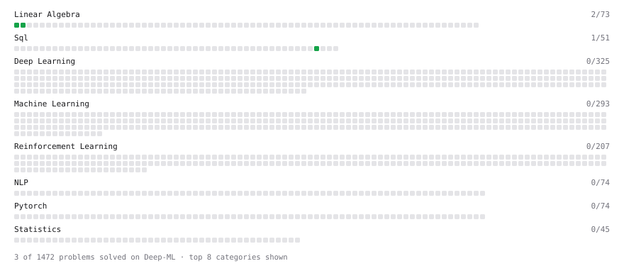

# Deep-ML

My machine learning practice from [Deep-ML](https://www.deep-ml.com). Every solution here was written by hand.

**14** solved · 13 problems · 1 labs · 0 math

[**Browse the interactive portfolio**](https://sanjayk36725.github.io/deep-ml-solutions/) to replay this filling in over time.

## Problems

| | Difficulty | Solved | |
| --- | --- | --- | --- |
| [Calculate 2x2 Matrix Inverse](https://www.deep-ml.com/problems/8) | easy | 2026-09-30 | [solution](problems/0008-calculate-2x2-matrix-inverse) |
| [Calculate Covariance Matrix](https://www.deep-ml.com/problems/10) | easy | 2026-09-30 | [solution](problems/0010-calculate-covariance-matrix) |
| [Calculate Mean by Row or Column](https://www.deep-ml.com/problems/4) | easy | 2026-09-29 | [solution](problems/0004-calculate-mean-by-row-or-column) |
| [Customers Who Never Placed an Order](https://www.deep-ml.com/problems/1460) | easy | 2026-09-29 | [solution](problems/1460-customers-who-never-placed-an-order) |
| [Implement the Softsign Activation Function](https://www.deep-ml.com/problems/100) | easy | 2026-09-29 | [solution](problems/0100-implement-the-softsign-activation-function) |
| [Implement the Swish Activation Function](https://www.deep-ml.com/problems/102) | easy | 2026-09-29 | [solution](problems/0102-implement-the-swish-activation-function) |
| [Matrix-Vector Dot Product](https://www.deep-ml.com/problems/1) | easy | 2026-09-29 | [solution](problems/0001-matrix-vector-dot-product) |
| [Reshape Matrix](https://www.deep-ml.com/problems/3) | easy | 2026-09-29 | [solution](problems/0003-reshape-matrix) |
| [Scalar Multiplication of a Matrix](https://www.deep-ml.com/problems/5) | easy | 2026-09-30 | [solution](problems/0005-scalar-multiplication-of-a-matrix) |
| [Single Neuron](https://www.deep-ml.com/problems/24) | easy | 2026-09-29 | [solution](problems/0024-single-neuron) |
| [Transpose of a Matrix](https://www.deep-ml.com/problems/2) | easy | 2026-09-29 | [solution](problems/0002-transpose-of-a-matrix) |
| [Longest Substring / Subarray with Two Pointers](https://www.deep-ml.com/problems/1148) | medium | 2026-07-08 | [solution](problems/1148-longest-substring-subarray-with-two-pointers) |
| [Poisson Deviance and Overdispersion](https://www.deep-ml.com/problems/1367) | medium | 2026-09-29 | [solution](problems/1367-poisson-deviance-and-overdispersion) |

## Labs

| | Difficulty | Solved | |
| --- | --- | --- | --- |
| [Train a Binary Classifier](https://www.deep-ml.com/labs/23) | easy | 2026-09-29 | [solution](labs/0023-train-a-binary-classifier) |

---

_This file is regenerated by Deep-ML on every push._
